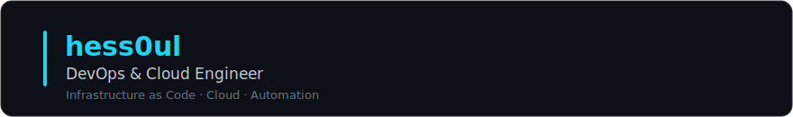

<div align="center">



[](https://www.linkedin.com/in/thomas-maxime-petitjean/)


</div>

## 👤 About

**Junior DevOps & Cloud Engineer.**

I've been hooked on computers since I was a kid, hardware and software alike. What I love about this job is simple: **automating things and seeing the impact**. I'd rather spend an hour teaching a task to run itself than do it by hand twice, and I like digging until I actually understand how a system works, not just how to use it.

Away from the terminal, I spend a good part of my time on the **financial markets**, where I bring the same mindset: analyze, backtest, automate.

- 🎓 &nbsp;Master's degree in IT project management
- 🌍 &nbsp;Languages: French (native), English

## 🧰 Tech Stack

**☁️ Cloud & IaC**


**📦 Containers & Orchestration**


**🔁 CI/CD & Versioning**


**⚙️ Scripting & Automation**


**🖥️ Systems & OS**


**📊 Monitoring**


![Centreon](https://img.shields.io/badge/Centreon-232F3E?style=for-the-badge&logo=data%3Aimage%2Fsvg%2Bxml%3Bbase64%2CPHN2ZyB4bWxucz0iaHR0cDovL3d3dy53My5vcmcvMjAwMC9zdmciIHdpZHRoPSI2NCIgaGVpZ2h0PSI2NCIgdmlld0JveD0iMTAuMzYgMTMuMTYgNTkuNzc3IDU4LjM2MSIgZmlsbC1ydWxlPSJldmVub2RkIj48cGF0aCBkPSJNNDIuMDY0IDMzLjMxOGwtMS4xNDcgMS4zNzZjLTEuNjA0IDIuMTI4LTIuNDQ0IDQuNTMyLTIuNTYgNy4ybC0uMDM0LjQ0NmgtMjcuOTRjLS4wNDgtMS4wMTYuNC0xLjgxOCAxLjExNi0yLjQ4Mmw0LjYwNi00LjE4OCAxMy41OTItMTIuMzM1IDEuMjk4LTEuMTQuNDc3LjUxNyAxMC41OTIgMTAuNjE0eiIgZmlsbD0iIzAwYTZhMCIvPjxwYXRoIGQ9Ik0xMC4zODMgNDIuMzMybDI3Ljk0LS4wMDFjLjA2IDEuMjQyLjE5OCAyLjQ3LjU2NSAzLjY2NS41NTQgMS44MDUgMS40NDYgMy40MjIgMi43MTMgNC44MjdsLjQuNS0uNC40MjMtMTAuMzMgMTAuMzMtLjM3Ni4zNDctMy41MzItMy4xNi0xNS43Ni0xNC4zYy0uNjA1LS41NDgtMS4wNS0xLjE3NS0xLjIxMy0xLjk4NC0uMDQzLS4yLS4wNzMtLjQyLS4wMjctLjYzNXoiIGZpbGw9IiMwMGE4ZWIiLz48cGF0aCBkPSJNMzAuOTE0IDYyLjQxM2wuMzc2LS4zNDcgMTAuMzMtMTAuMzMuNC0uNDIzTDQzLjcgNTIuN2ExMi42OCAxMi42OCAwIDAgMCA3IDIuMzVjLjEyOC4wMDQuMjU1LjAyMi4zODIuMDM0bC4wMDEgMTUuNzEyYy0xLjMwOC4wNy0yLjYwNy0uMDY2LTMuODk2LS4yNDYtNC41Mi0uNjMtOC42Ny0yLjIzOC0xMi40MTMtNC44NjItMS4zODQtLjk3LTIuNzAzLTIuMDIzLTMuODUtMy4yNzV6IiBmaWxsPSIjMzI3MGI2Ii8%2BPHBhdGggZD0iTTQyLjA2NCAzMy4zMThsLTUuNTE4LTUuNTM3LTUuMDc0LTUuMDc3LS40NzctLjUxN2MxLjE2Ny0xLjI2MiAyLjUwNS0yLjMyNCAzLjkxNi0zLjI5NSAzLjkxMi0yLjcgOC4yMy00LjMwOCAxMi45NTItNC44MzIgMS4wNi0uMTE4IDIuMTIzLS4yMjQgMy4xOTMtLjE2bC4wMDYgMTUuNjkzYy0xLjI4LjA3Mi0yLjU0NS4yMi0zLjc3NS42MDgtMS43OTcuNTY3LTMuMzkyIDEuNDgtNC43ODYgMi43NDctLjE0LjEyOC0uMy4yNDYtLjQzNy4zN3oiIGZpbGw9IiMwMGFmMzUiLz48cGF0aCBkPSJNNTEuMDcyIDcwLjc5NWwtLjAwMS0xNS43MTJjMS4zMDYtLjA2IDIuNTk1LS4yMiAzLjg0Ni0uNjI2YTEzLjA5IDEzLjA5IDAgMCAwIDMuMTE2LTEuNDgzYy43MjctLjQ3MiAxLjUwOC0uNjgzIDIuMzc4LS41NGEyLjczIDIuNzMgMCAwIDEgMS41MjMuNzYxbDcuMjYgNy4yNjJhMy41MiAzLjUyIDAgMCAxIC42OTQuOTk1Yy40MzcuOTMuMjgyIDEuODYtLjQ0IDIuNTk3LS4xNjQuMTY3LS4zNDguMzE3LS41MzIuNDY0LTQuMjYzIDMuNDA4LTkuMDk2IDUuNDYtMTQuNTIgNi4wOTUtMS4xMDQuMTMtMi4yLjI0NC0zLjMyNC4xODZ6IiBmaWxsPSIjM2ExZTdkIi8%2BPHBhdGggZD0iTTUxLjA2MiAyOS41OTNMNTEuMDU2IDEzLjljLjg3Ny0uMDg3IDEuNzUyLjAxIDIuNjIuMWEyOC4yMyAyOC4yMyAwIDAgMSA5LjA2NCAyLjM3OSAyOC40IDI4LjQgMCAwIDEgNi4zMDYgMy44OThjMS4yOTYgMS4wNTggMS40NCAyLjMxNy40MiAzLjYzNy0uMTU2LjIwMi0uMzM2LjM4Ny0uNTE3LjU3bC02LjggNi44Yy0xLjA0OCAxLjA3OC0yLjYyNSAxLjM4Ni00LjAyNy40OC0yLjEyLTEuMzctNC40MjUtMi4xLTYuOTQ0LTIuMTQ2LS4wNDIgMC0uMDgzLS4wMTYtLjEyNS0uMDI2eiIgZmlsbD0iIzZmYzIyNyIvPjwvc3ZnPg%3D%3D)


**📋 Project Management & Collaboration**


## 📈 After Hours

Outside of infrastructure, the markets are my other playground. The
engineering mindset carries over directly: build a system, test it, automate
it, and let the data decide.

- 📊 &nbsp;**Algorithmic trading** : designing, backtesting and automating strategies
- 🌊 &nbsp;**Order flow trading** : reading market microstructure, volume and liquidity
- 🏦 &nbsp;**Prop firms** : trading funded accounts with precise rules
- 🧮 &nbsp;A broader interest in **institutional and quantitative finance**

## 🏠 Homelab

I learn best by running real infrastructure at home, then documenting every change.
It is a versioned project, treated with the same rigor as production work.

```text
[ OK ]  Proxmox VE hypervisor . . . . ~10 LXC/VM (Docker, Nextcloud, Immich, Vaultwarden)
[ OK ]  OpenWrt router . . . . . . . . 6 segmented VLANs, firewall, dual-WAN failover (fiber + 5G)
[ OK ]  Reverse proxy + TLS . . . . . wildcard certs via ACME DNS-01, auto-renewed
[ OK ]  Edge security . . . . . . . . CrowdSec WAF, zero open ports (Cloudflare tunnel)
[ OK ]  Documentation . . . . . . . . ADRs, changelog, conventions, infra-as-doc
```

## 📊 GitHub Stats

<div align="center">


<br/>

<picture>
  <source media="(prefers-color-scheme: dark)" srcset="https://raw.githubusercontent.com/hess0ul/hess0ul/output/github-contribution-grid-snake-dark.svg" />
  <source media="(prefers-color-scheme: light)" srcset="https://raw.githubusercontent.com/hess0ul/hess0ul/output/github-contribution-grid-snake.svg" />
  
</picture>

</div>
